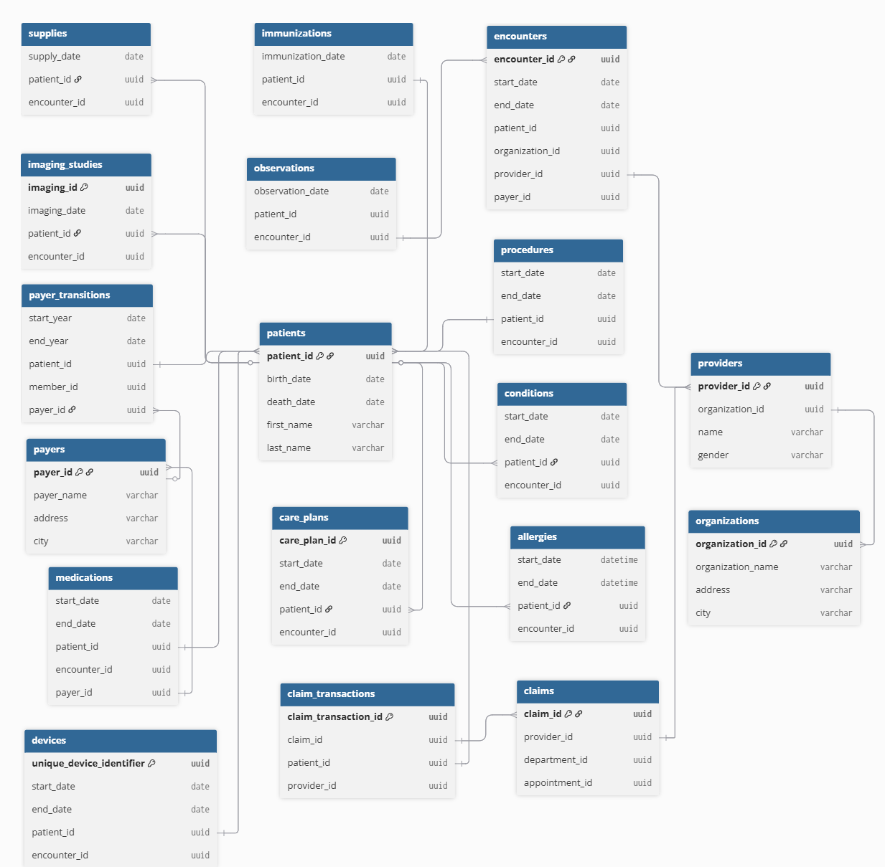

# Healthcare Analytics

This project standardizes healthcare domain datasets into analytics-ready models and validates key data quality rules before reporting.

## 1. Problem Statement

Healthcare organizations generate large, fragmented operational data across claims, encounters, medications, supplies, providers, and patient demographics. Raw datasets are often inconsistent, hard to trust, and not immediately usable for analytics.

This project solves that by building a reliable analytics pipeline that:
- Centralizes healthcare datasets in MotherDuck.
- Transforms raw records into clean, standardized dbt models across `staging`, `intermediate`, and `marts` layers.
- Enforces data quality checks with Great Expectations before reporting.
- Produces business-ready summary tables for downstream BI (Power BI).

## 2. Business Questions

The transformed marts are designed to answer high-impact healthcare analytics questions, including:
- **Claims performance:**
  - What is total claims transaction amount, payments, adjustments, transfers, and outstanding balance over time?
  - Which claim statuses and diagnoses are most common?
- **Patient utilization and cost:**
  - Which patient segments generate the highest healthcare expenses and claim activity?
  - How do utilization patterns vary by demographics and geography?
- **Provider performance:**
  - Which providers handle the most encounters/claims?
  - How do financial outcomes differ by provider specialty, city, and state?
- **Encounter trends:**
  - What encounter classes are most frequent (wellness, inpatient, outpatient, emergency, etc.)?
  - How do encounter mix and volumes shift over time?
- **Payer and coverage insights:**
  - How do payer transitions and coverage patterns relate to claims and patient outcomes?
- **Data reliability for decision-making:**
  - Are critical fields present and valid (for example, patient birth dates, provider zip codes, valid status/category values)?

Business problems solved:
- Reduces manual reporting effort through modeled marts.
- Improves trust in analytics with automated data validation.
- Enables faster decisions for finance, operations, and care management teams.

## 3. Architecture


High-level flow:
1. Raw healthcare CSV datasets are extracted from Kaggle, compressed into `.parquet` files.
 
    **Entity Relationship Diagram: Raw Data Files**


2. Compressed data is loaded into `healthcare.raw.*` tables in MotherDuck.

3. dbt transforms raw tables into:
   1. `staging` models (`stg_*`)
   2. `intermediate` models (`int_*`)
   3. `marts` summary models (`mrt_*`)
4. Great Expectations scripts validate key table-level business/data rules.
5. Curated marts can be consumed by BI tools like Power BI.


## 4. Data Preparation

Convert local CSV files to compressed Parquet:

```bash
cd data
python extract/compressor.py
```

`extract/compressor.py` scans the current folder for `.csv` files and creates `.parquet` versions with Snappy compression.

## 5. Loading Data to MotherDuck

dbt staging models expect raw source tables named:

`healthcare.raw.<table_name>`

Examples:
- `healthcare.raw.claims`
- `healthcare.raw.claims_transactions`
- `healthcare.raw.patients`

Before running dbt, ensure your raw datasets are loaded into those MotherDuck tables.

## 6. Data Model Layers

Current dbt model coverage:
- `staging`
- `intermediate`
- `marts`

Examples:
- Staging: `stg_claims`, `stg_patients`, `stg_providers`
- Intermediate: `int_patient_claims`
- Marts: `mrt_claims_summary`, `mrt_patient_summary`, `mrt_provider_summary`

## 7. Great Expectations Checks

Validation scripts are in `great-expectations/` and use MotherDuck table assets via environment variables.

Run examples:

```powershell
python great-expectations\claims.py
python great-expectations\patients.py
python great-expectations\providers.py
python great-expectations\supplies.py
python great-expectations\medications.py
python great-expectations\encounters.py
python great-expectations\claim_transactions.py
python great-expectations\allergies.py
```

Examples of rules currently implemented:
- Claims: `first_status` values constrained to approved set
- Patients: `birth_date` column existence
- Providers: `zip_code` length constraints
- Supplies/Medications: value range checks
- Allergies: allowed values for category/system

## 8. GitHub Actions CI

Workflow file: `.github/workflows/ci.yml`

Pipeline jobs:
1. `python-syntax`
   - Compiles Python files in `great-expectations/` and `extract/`
2. `dbt-parse`
   - Installs `dbt-core` and `dbt-duckdb`
   - Generates CI dbt profile
   - Runs `dbt parse`

Repository secrets for MotherDuck-enabled CI:
- `MOTHERDUCK_DATABASE`
- `MOTHERDUCK_TOKEN`

If secrets are not configured, CI falls back to in-memory DuckDB for parse-only validation.

## 9. Prerequisites

- Python `3.11+`
- `pip`
- MotherDuck account + token
- dbt-compatible DuckDB setup

## 10. Local Setup

1. Create and activate a virtual environment.

```bash
python -m venv venv
source venv/bin/activate
```

2. Install dependencies.

```bash
pip install -r requirements.txt
```

3. Create/update `.env` in the repo root.

```env
# Core MotherDuck connection
MOTHERDUCK_TOKEN=your_motherduck_token
MOTHERDUCK_DATABASE=healthcare
```

## 11. Repository Structure

```text
healthcare-analytics/
|-- assets/
|   |-- ERD.png
|   |-- architecture.svg
| 
|-- dbt/
|   |-- carehouse/
|       |-- dbt_project.yml
|       |-- models/
|           |-- staging/
|           |-- intermediate/
|           |-- marts/
|-- extract/
|   |-- compressor.py             # CSV -> Parquet 
|-- great-expectations/
|   |-- allergies.py
|   |-- claims.py
|   |-- claim_transactions.py
|   |-- encounters.py
|   |-- medications.py
|   |-- patients.py
|   |-- providers.py
|   |-- supplies.py
|-- .github/workflows/
    |-- ci.yml
```

## 12. Contributing

Contributions are welcome!

1. Create a feature branch

   ```bash
   git checkout -b feature/xyz
   ```

2. Commit changes

   ```bash
   git commit -m "Add xyz feature"
   ```

3. Push to branch

   ```bash
   git push origin feature/xyz
   ```

4. Open a Pull Request.
